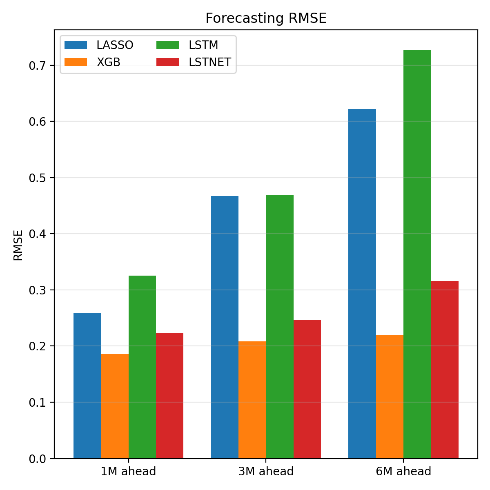

# Inflation Forecasting Project

**Current status:** pipeline completed

**Ongoing work:** Further tuning and robustness analysis

## Setup and Workflow

Install the required dependencies:
   ```
   pip install -r requirements.txt
   ```

Running `run_main.py` executes the full pipeline.

### Project structure
- `run_main.py`: Entry point. Runs all models, calculates and plots model-comparison evaluation metrics.
- `src/`: Evaluation and visualization utilities.
- `src/models/`: Callable forecasting model modules.
- `config/my_config.yaml`: Central configuration file (data paths, horizons, training settings...).
- `old_models/`: Archived old draft scripts (kept for reference, not used).

## Overview

This project extends the IMF Working Paper by Liu et al. (2024) on machine-learning based inflation forecasting. In their original study, the authors implement four classical supervised learning models, engineered for time series forecasting, to predict inflation in Japan. Japan provides a particularly informative testing ground, having experienced nearly three decades of near-zero inflation followed by an unusual inflation surge in recent years. This environment offers a natural setting to evaluate whether machine learning methods outperform traditional econometric time series models under conditions of high uncertainty.

In the original paper, the authors evaluate LASSO, Elastic Net, Random Forest, and XGBoost models. Among these approaches, LASSO is found to deliver the strongest forecasting performance.

I extend their analysis in two directions. First, I implement a more extensively tuned XGBoost model. Second, I introduce two deep learning approaches: a standard LSTM model and a custom implementation of the LSTNet architecture. For better comparability, I also reimplement LASSO within the forecasting pipeline.

### Current results

Models are trained using MSE/RMSE loss. Forecast accuracy is evaluated using out-of-sample RMSE. For DL models, after pinning down hyperparameters, I retrain the model multiple times with different random seeds on the same training data, and average the predictions to reduce optimization variance.

Forecast performance is still sensitive to hyperparameter choices and random initialization; further tuning and robustness checks are ongoing.



## Data Structure

**Data are available upon request**

The data are expected to be provided in CSV format. Raw inputs are sourced from multiple files and merged during preprocessing. After running the `data_processing.py` script, a single processed CSV file is generated with the following structure:

- **`Date`**: Date column
- **`X1–X24`**: Time series variables (see the list below for detailed descriptions)

### Monthly series
- **X1**: CPI Inflation
- **X2**: USD–JPY exchange rate
- **X3**: Chained PPI index
- **X4**: PPI index
- **X5**: Service PPI index
- **X6**: Import price index
- **X7**: Import energy price index
- **X8**: Nikkei 225 index
- **X9**: Unemployment rate
- **X10**: Household total income
- **X11**: Consumption activity index
- **X12**: Shadow interest rate
- **X13**: Total loan size
- **X14**: Industrial production index
- **X15**: Monetary base
- **X16**: Tourist arrivals
- **X17**: ESP inflation expectations

### Quarterly series
- **X18**: Tankan survey output price change
- **X19**: Tankan survey input price change
- **X20**: Real GDP
- **X21**: BOJ calcuated output gap
- **X22**: Household disposable income
- **X23**: Government consumption
- **X24**: Government investment

### Converting quarterly date to monthly frequency

For quarterly series, I convert them to monthly frequency using only information available within each month in order to avoid information leakage.

### Feature transformation

All features are in, or converted to pertentages. For features that are in percentages, no transformation is needed. For features that are in levels or raw indices, I calculate YoY percentage changes.

### Feature engineering for supervised models

For supervised learning models, I construct lagged and differenced features for each variable. In the current version, the maximum lag length is set to six months.
